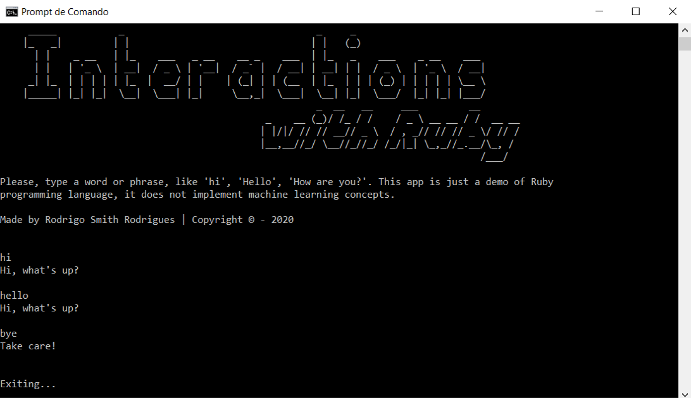

# Interactions-with-Ruby 

##### A simple program which interacts with user, programmed with Ruby language

A simple game using Python programming language, through Py-game library. It´s a very tiny app, but is a introdution for 
2D games development with Python. The used library allows many possibilities, just like that:

## Hoy to use?

By [W, A, S, D] and [up, down, left, right], you can control each circle. When the pink cirlce pass horizontally through yellow, it change its color.

## Requirements

Just have the Python 3.7 in your machine (https://www.python.org/downloads/release/python-377/), download the game and execute it.

# License

Copyright &copy; Rodrigo Smith 2020.

Distributed under the GNU GENERAL PUBLIC LICENSE V3 license. See LICENSE for more information.
